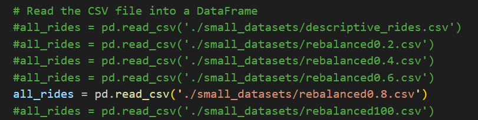
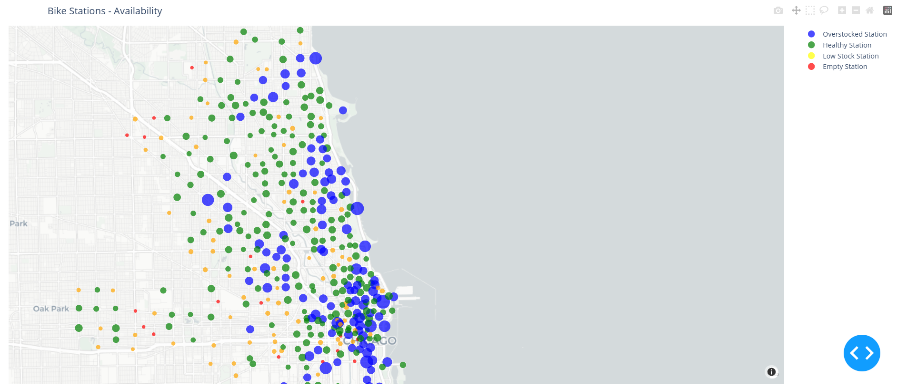

# MS_project

The purpose of this project is to build a simulation model of a shared eletrical bike system that manages to redistribute bikes between stations. In order to make communication between agents (bikes, stations), protocol XMPP is used. The agents then proceed to enact their behaviors congruent with a pre processed dataset [Chicago Dataset](https://divvy-tripdata.s3.amazonaws.com/index.html) making the base model a descriptive model. The second model attempts to achieve the same purpose only by changing the controllable variables values making it a speculative model. The second scenario for this model introduces new endogenous variables in the form of incentives for the agents to change their behaviors.

## Logic Behind

We have already running the `predict_rides.py` script with the necessary adaptions to generate the csv files containing the predicted rides for the following scenarios:

1. Descriptive Scenario - *descriptive_rides.csv*
2. User acceptance level to system incentives:
    - rebalanced to 20% acceptance - *rebalanced0.2.csv*
    - rebalanced to 40% acceptance - *rebalanced0.4.csv*
    - rebalanced to 60% acceptance - *rebalanced0.6.csv*
    - rebalanced to 80% acceptance - *rebalanced0.8.csv*
    - rebalanced to 100% acceptance - *rebalanced100.csv*

In the *utils.py* file we can choose which scenario to run in the simulation. The default one is the rebalanced of 80% of user acceptance:

If we want to see other scenario running, we just have to uncomment the correspondent line.

## Start and Run the project

When we run `python ./main.py` it will start the host and run the simulation.

Then you should open the link `http://127.0.0.1:8050/` in the browser to see the simulation running.

Stations will change **colour** and **size** according to its number of bikes available.

The station colors in the map represent the availability of bikes at each station, categorized as follows:

- **Red**: The station is empty with 0 bikes available.
- **Orange**: The station has between 1 and 5 bikes available, indicating low availability.
- **Green**: The station has between 6 and 15 bikes available, indicating moderate availability.
- **Blue**: The station has more than 15 bikes available, indicating high availability.

Stations do not have maximum capacity defined.
