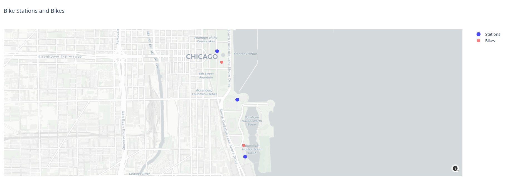

# MS_project

The purpose of this project is to build a simulation model of a shared eletrical bike system that manages to redistribute bikes between stations after X time lapse ending with a high median of bikes per station. In order to make communication between agents (bikes), protocol XMPP is used. The agents then proceed to enact their behaviors congruent with a pre processed dataset [Chicago Dataset](https://divvy-tripdata.s3.amazonaws.com/index.html) making the base model a descriptive model. The second model attempts to achieve the same purpose only by changing the controllable variables values making is a speculative model. A second scenario for this model introduces new endogenous variables in the form of incentives for the agents to change their behaviors.

In project current state it only works with *some_stations.csv*  and  *some_trips.csv* datasets.

Later, to run the project you should first put *tripdata.csv* file from discord in datasets folder and run the notebook *clean_data.ipynb* to create csv files *all_stations* and *all_trips* (the last is not used for now).

## Start and Run the project

### 1 -  Start the web browser for ploty visualization

1.  To start the ploty web server you should open a new terminal and navigate to spade_project folder by doing: `cd .\spade_project\`

2. Then you should run `make run_host` to run the script that will start the server.
3 - Then you should open the link `http://127.0.0.1:8050/` in the browser.

    

### 2 - Run the SPADE project
1.  `cd .\spade_project\` then run `python .\agent.py\`, `python .\sub_client.py\`, `python .\pub_client.py\`, the order is irrelevant.

